# 🚀 Sociopedia

<div align="center">

# 🌐 Production-Ready Dockerized MERN Application

### 🐳 Docker • 🌍 Nginx Reverse Proxy • ☁️ MongoDB Atlas • ⚡ Production Architecture

<p align="center">


</p>

</div>

---

# 📖 About Sociopedia

**Sociopedia** is a **production-ready full-stack social media platform** built using the MERN stack and containerized with Docker using enterprise deployment practices.

The project demonstrates how modern applications are packaged, secured, networked, and deployed using production-grade Docker techniques.

Instead of running services individually, the complete application is deployed using **Docker Compose**, **Nginx Reverse Proxy**, isolated Docker networks, persistent volumes, and MongoDB Atlas integration.

---

# ✨ Key Features

## 👥 Social Media Platform

- User Authentication
- JWT Authorization
- Create Posts
- Like & Comment
- Friend System
- Responsive UI

---

## ⚛ Frontend

- React.js
- Redux Toolkit
- Material UI
- Responsive Design
- Protected Routes
- API Integration

---

## 🚀 Backend

- Node.js
- Express.js
- JWT Authentication
- REST APIs
- Secure Middleware
- MongoDB Integration

---

## 🐳 Production Docker Features

- Multi-stage Docker Build
- Docker Compose
- Non-root Containers
- Health Checks
- Docker Networks
- Persistent Volumes
- Environment Variables
- Reverse Proxy
- Production Ready Images

---

# 🌐 Live Deployment

## Frontend

https://sociopedia-app.vercel.app

---

## Backend API

https://urchin-app-v2nci.ondigitalocean.app

---

# 🏗 High Level Architecture

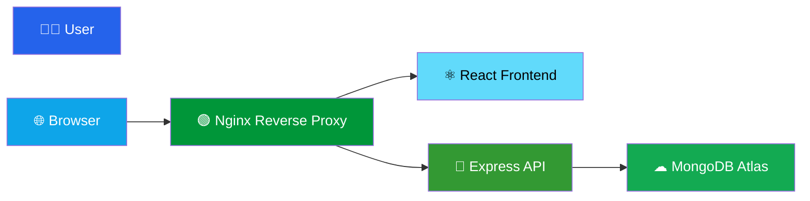

---

# 🏢 Enterprise System Architecture

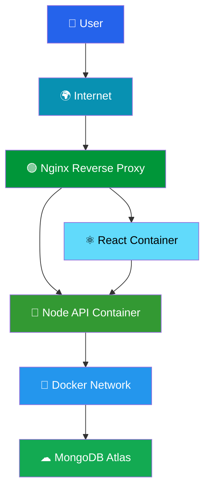

---

# 🔄 Request Flow

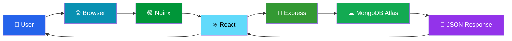

---

# 📸 Application Preview

## 🌙 Dark Theme UI

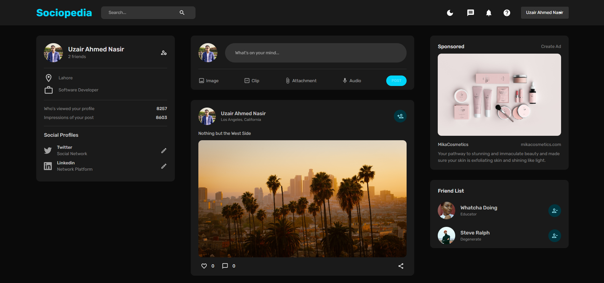

---

## 🗄 Database Schema

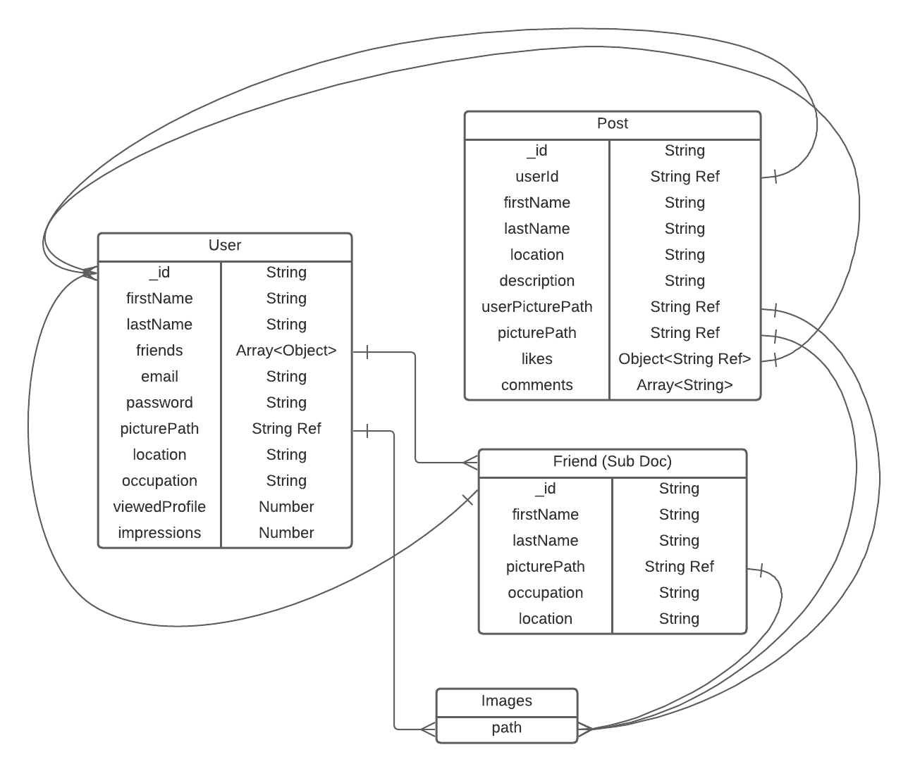

---

---

# 🐳 Docker Architecture

Sociopedia is fully containerized using Docker following production-ready best practices. Each service runs in its own isolated container while communicating through a dedicated Docker network.

## 🚀 Docker Container Architecture

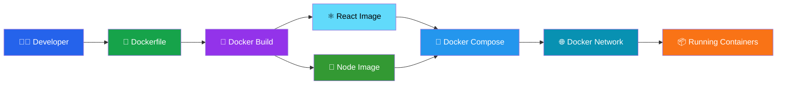

---

# 🏗 Multi-Stage Docker Build

The frontend is built using a multi-stage Docker build to reduce image size and improve production performance.


---

# 🌍 Docker Compose Architecture

Docker Compose orchestrates all application services using a single configuration file.

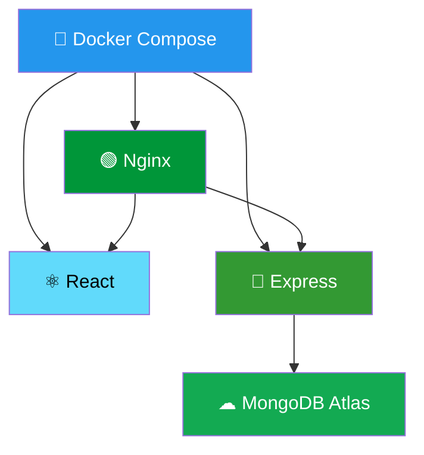

---

# 🌐 Nginx Reverse Proxy

Nginx acts as the entry point for every incoming request and intelligently routes traffic to the appropriate service.

## Request Routing

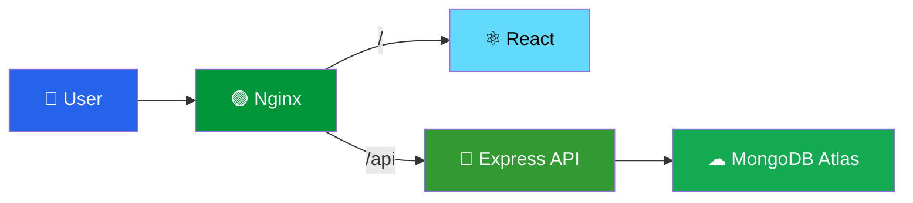

---

# 🔒 Container Security

Production containers follow Docker security best practices.

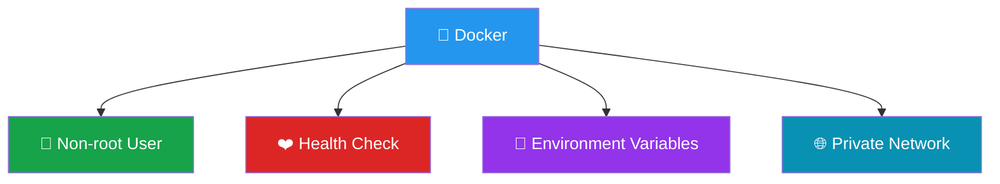

### Security Features

- ✅ Non-root containers
- ✅ Environment variables
- ✅ Health check endpoint
- ✅ Docker network isolation
- ✅ Production images
- ✅ Lightweight containers

---

# 🌐 Docker Networking

All services communicate through a dedicated isolated Docker bridge network.

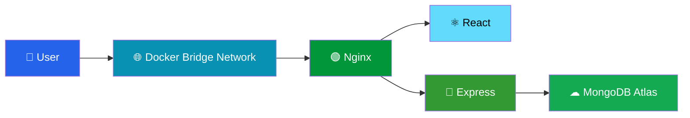

---

# 💾 Persistent Storage

Application data remains safe using Docker volumes.

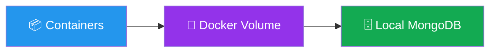

---

# ☁ MongoDB Atlas Integration

The backend securely communicates with MongoDB Atlas using encrypted cloud connections.


---

# 📂 Project Structure

```text
docker-project/
│
├── client/
│   ├── src/
│   ├── public/
│   ├── Dockerfile
│   └── package.json
│
├── server/
│   ├── controllers/
│   ├── routes/
│   ├── middleware/
│   ├── models/
│   ├── Dockerfile
│   └── package.json
│
├── nginx/
│   ├── nginx.conf
│   └── Dockerfile
│
├── docker-compose.yml
├── .env
├── README.md
└── dark_theme_ss.png
```

---

# 🛠 Technology Stack

## Frontend

- React.js
- Redux Toolkit
- Material UI

---

## Backend

- Node.js
- Express.js
- MongoDB
- Mongoose

---

## DevOps

- Docker
- Docker Compose
- Nginx
- Multi-Stage Docker Build
- Docker Networks
- Docker Volumes

---

## Cloud

- MongoDB Atlas
- DigitalOcean
- Vercel

---
