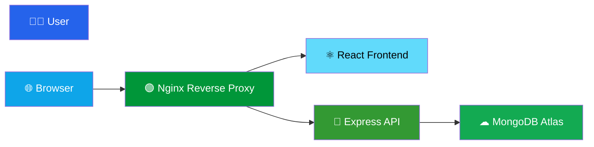
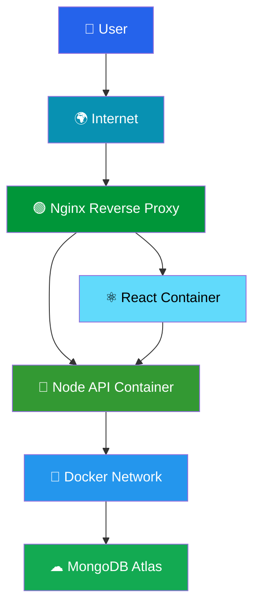
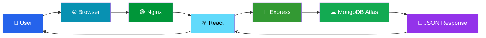

# 🚀 Sociopedia

# 🌐 Production-Ready Dockerized MERN Application

### 🐳 Docker • 🌍 Nginx Reverse Proxy • ☁️ MongoDB Atlas • ⚡ Production Architecture

---

# 📖 About Sociopedia

**Sociopedia** is a **production-ready full-stack social media platform** built using the MERN stack and containerized with Docker using enterprise deployment practices.

The project demonstrates how modern applications are packaged, secured, networked, and deployed using production-grade Docker techniques.

Instead of running services individually, the complete application is deployed using **Docker Compose**, **Nginx Reverse Proxy**, isolated Docker networks, persistent volumes, and MongoDB Atlas integration.

---

# ✨ Key Features

## 👥 Social Media Platform

- User Authentication
- JWT Authorization
- Create Posts
- Like & Comment
- Friend System
- Responsive UI

---

## ⚛ Frontend

- React.js
- Redux Toolkit
- Material UI
- Responsive Design
- Protected Routes
- API Integration

---

## 🚀 Backend

- Node.js
- Express.js
- JWT Authentication
- REST APIs
- Secure Middleware
- MongoDB Integration

---

## 🐳 Production Docker Features

- Multi-stage Docker Build
- Docker Compose
- Non-root Containers
- Health Checks
- Docker Networks
- Persistent Volumes
- Environment Variables
- Reverse Proxy
- Production Ready Images

---

# 🌐 Live Deployment

## Frontend

https://sociopedia-app.vercel.app

---

## Backend API

https://urchin-app-v2nci.ondigitalocean.app

---

# 🏗 High Level Architecture

---

# 🏢 Enterprise System Architecture

---

# 🔄 Request Flow

---

# 📸 Application Preview

## 🌙 Dark Theme UI

---

## 🗄 Database Schema

---
