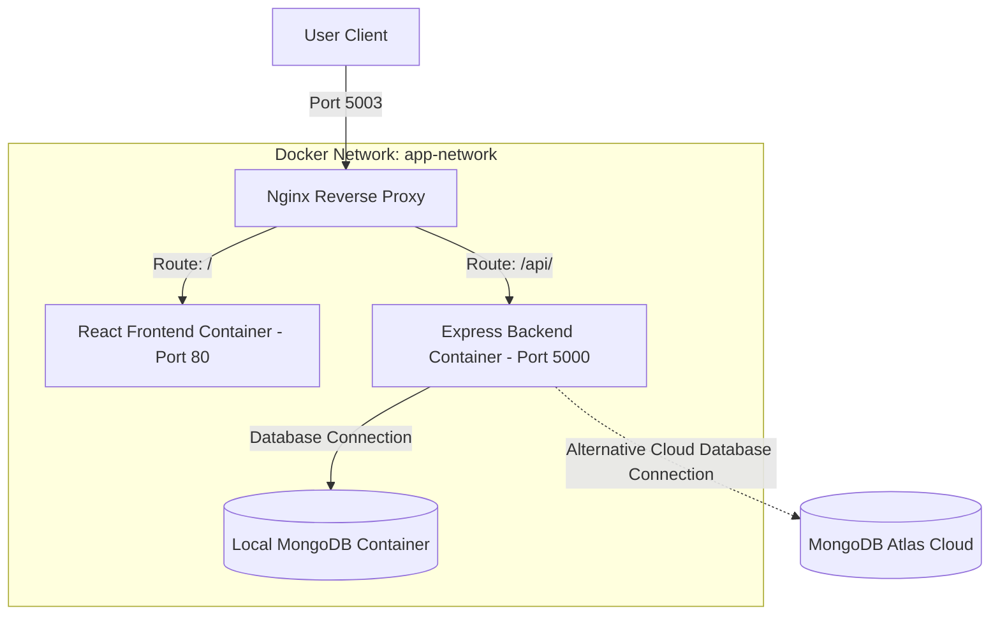

# Sociopedia - Production-Ready Dockerized MERN Application

Sociopedia is a full-stack social media web application built using the MERN stack and containerized using Docker, incorporating production-level DevOps and deployment practices.

---

## Live Deployment

- Frontend (Vercel): https://sociopedia-app.vercel.app  
- Backend API (DigitalOcean): https://urchin-app-v2nci.ondigitalocean.app  

---

## Tech Stack

### Frontend
- React
- Redux Toolkit
- Material UI

### Backend
- Node.js
- Express.js
- MongoDB (Mongoose)

### DevOps and Infrastructure
- Docker
- Docker Compose
- Nginx (Reverse Proxy and Load Balancer)
- MongoDB Atlas (Cloud Database)
- Multi-stage Docker builds
- Non-root container security
- Container health checks
- Custom isolated Docker networks
- Docker volume persistence

---

## Architecture Overview

The system architecture routes traffic through Nginx to either the static React frontend or the Express API backend, which communicates with the MongoDB database.



---

## Project Structure

```text
project/
│
├── server/ # Backend (Node + Express)
├── client/ # Frontend (React)
├── nginx/ # Nginx configuration
├── docker-compose.yml
├── .env
└── README.md
```

---

## Environment Variables

To run the application locally, create a .env file in the root directory:

```env
PORT=5000
MONGO_URL=mongodb+srv://<username>:<password>@cluster.mongodb.net/sociopedia
JWT_SECRET=your_secret_key
```

Note: Do not commit the .env file to version control.

---

## Running the Application with Docker

### Build and Start Containers

```bash
docker-compose down -v
docker-compose up -d --build
```

### Access Application

The application is accessible through Nginx at:
http://localhost:5003

---

## Production Features Implemented

- Complete containerization of frontend and backend services.
- Multi-stage React production build to minimize frontend image size.
- Secured backend containers running as a non-root user.
- Reverse proxy and load balancing implemented using Nginx.
- Seamless MongoDB Atlas cloud database integration.
- Automated health check endpoints for container monitoring.
- Docker log rotation configured to prevent disk space exhaustion.
- Persistent volumes mapped for the local database container.
- Isolated, dedicated Docker network for internal container communication.
- Ready for horizontal scaling and zero-downtime deployments.

---

## Backend Health Endpoint

GET /health

Returns:
200 OK

---

## Application Preview


---

## Database Schema


---

## Key Learning Outcomes

- Applying containerization best practices to multi-tier web applications.
- Managing native npm dependencies inside specialized Docker environments.
- Handling configuration and environment variables securely.
- Resolving Docker networking conflicts and configuring port forwarding.
- Integrating and securing cloud databases.
- Structuring production-ready configurations for backend nodes.

---

## Future Improvements

- Automating CI/CD pipelines with GitHub Actions.
- Deploying services to AWS EC2.
- Automating HTTPS certificate acquisition using Let's Encrypt.
- Monitoring services with Prometheus and Grafana.
- Migrating container orchestration to Kubernetes.

---

## Acknowledgments

This project was inspired by the tutorial by EdRoh:  
https://youtu.be/K8YELRmUb5o

---

## Authors

Saurav Singh  
B.Tech CSE | Full Stack and DevOps Enthusiast

Krish Mishra  
Co-author
